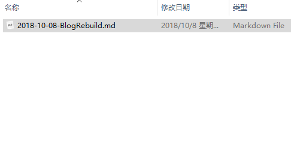

标题测试

H1

# H1

H2

## H2

H3

### H3

粗体字测试

**粗体**

横线测试

---

引用测试

> this is a quote
>
> this is also a quote

代码块测试

```python
import re
print "fire in the hole!"

```

序号测试

- 1
- 2
- 3

删除线测试

~~this is deleted~~

截图测试



