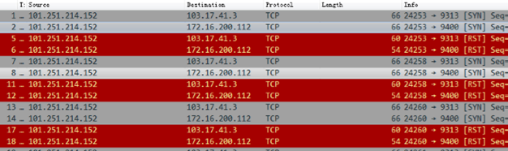
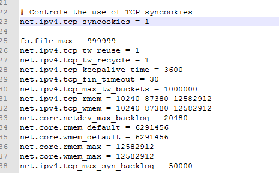
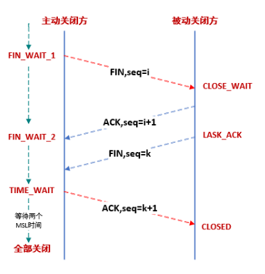

# 问题描述

XX用户是移动互联网运营支撑服务商, 主要业务是为各大运营商/电商/互联网企业提供移动信息平台(既验证短信发送). 

日前为某客户开发的一个业务系统时, 压测会出现少量发送失败的情况.                                                  

该业务系统使用的是A10的负载均衡, 从windows压测端发起的压力为2000rps, 压测一段时间后就会出现报错.

用户反馈这个系统在珠海机房, 单机不经任何负载均衡直接使用linux客户端压测可以到4w rps无任何报错. 所以怀疑是A10设备配置问题.

# 排查过程

用户的A10配置为普通4层负载. 只是做了一个SLB映射出去.

slb virtual-server 103.17.41.3 103.17.41.3

   port 9313  tcp

​      name _103.17.41.3_TCP_9313

​      service-group TEST_NEW

​      use-rcv-hop-for-resp

从用户处了解到, 业务系统使用的场景为TCP短链接, 客户端跟后台请求验证字符串, 每次请求完主动断开链接. 怀疑可能是大量重复新建连接导致A10 VIP端口占满,导致无法接受新请求.

 

尝试配置vport模板, 启用忽略tcp msl选项再进行测试,通过公网压测还是有报错情况.

 

抓包发现, 有大量压测端发起的3次握手请求没有建立成功, 客户端收到syn包后, 是直接回了一个RST拒绝链接. 说明问题还是在服务器上, 服务器无法接受新的请求.

   

 

查看服务器配置, 后端服务器为centos6.3_64.

用户在服务器上打开了tw_reuse, tw_recycle.  

可用端口数, 最大打开句柄数也已经修改过. 

   

由于压测并不是一开始就出现报错, 而是压测几万次请求后才开始有报错, 此时后台tw状态的端口数量也达到了5W左右. 所以怀疑还是端口没有复用成功导致.

# 解决方法

查找相关资料后发现, 如果要复用tw状态的端口, 需要同时开启timestamp的参数. 

在linux操作系统, 该参数默认是启用状态, 但windows操作系统, 这个参数默认是关闭的. 

最后通过

**netsh int tcp set global timestamps=enabled**

启用该参数后再进行测试, 压测正常无报错.

   

# 原理

### 什么是time_wait

TCP链接断开后, 为确保本次TCP链接安全可靠的关闭, 在TCP链接关闭之前需要等待的时间就是time_wait.

这个时间是两倍MSL时间, linux下默认是60s. 

   

Time_wait虽然确保了链接之间互不影响, 也带来一些问题. 

如本次案例中, 服务器端收到了来自同一个客户端的大量TCP短链接,按TCP四元组(源IP/源端口/目的IP/目的端口), 由于这些链接中只有源端口是变化的,  如果按默认设置, 一旦客户端的65535个端口占满,  那么就无法从这个客户端发起新建了.

另外, 服务器端大量的tw状态链接, 也会占用一定的系统资源.

所以常用以下两个参数来进行调优.

### tcp_tw_reuse

tw_reuse主要影响是出向的访问. 需要开启timestamp参数.

开启后, 如果能确保本次新链接的timestamp大于前一个链接, 那么这个tw状态的链接就可以被复用. 

这个参数仅对客户端有效, 在服务端打开无意义. 

 

### tcp_tw_recycle

tw_recycle会对出入向的访问都造成影响. 同样需要开启timestamp参数.

开启后, 处于 TIME_WAIT 状态的链接超时时间不再是两个MSL时间长度, 而是等于RTO(retransmission timeout)时间. 

具体RTO时间可以通过命令计算:

ss --info  sport = :2112 dport = :4057

State    Recv-Q Send-Q    Local Address:Port        Peer Address:Port

ESTAB    0      1831936   10.47.0.113:2112          10.65.1.42:4057    

cubic wscale:7,7 **rto:564** rtt:352.5/4 ato:40 cwnd:386 ssthresh:200 send 4.5Mbps rcv_space:5792

 

另外recycle还要求在60s内, 同一个源IP的链接中, timestamp必须是递增的, 否则链接会被拒绝.

 

# 其他

本次问题的原因就是 windows压测时的发起的TCP请求中没有timestamp参数, 不满足recycle的要求, 请求就被拒绝了.

如果上到生产环境中, 多台客户端是通过NAT设备NAT成同一个源IP访问到这个系统, 即便客户端都开启了timestamp, 也会出现因为timestamp不一致而链接被拒绝的情况. 

所以最好的解决方法还是

1, A10 上配置vport模板, 忽略msl

2, 禁用tcp_tw_recycle选项, 增加后端服务器数量. 

参考:

1, <https://vincent.bernat.im/en/blog/2014-tcp-time-wait-state-linux>

2, <http://blog.sina.com.cn/s/blog_781b0c850100znjd.html>

