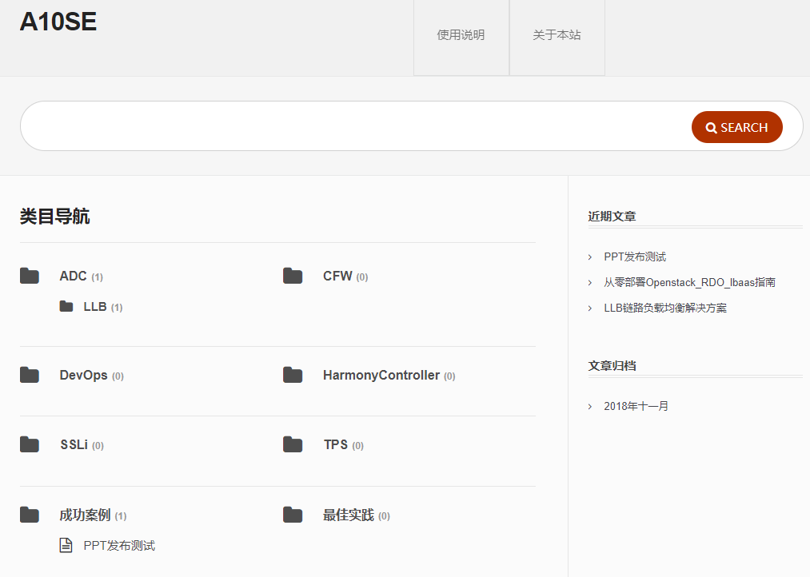

---
layout：post 

title： DocsPortal

date： 2018-11-14

---

## 规划

初衷是为了提高工作效率，原来公司的文档库用的是一个ftp，搜索，展示都不尽如人意。搭建这么一个文档库，就是为了提高工作效率。

那么，一个完整的文档库需要什么功能？ 

    -  完善的搜索功能；
    -  文件可图形化拖曳上传；
    -  具备访问权限管控功能；
    -  合理的目录规划；
    -  一个规章制度，确保文档库的文档能够与时俱进；

使用wordpress+知识库的主题基本可以满足文档库的所有需求。wordpress插件系统确实使用方便，功能丰富，唯一的问题就是主题都比较贵。

---

## 过程

#### LNMP+Wordpress安装

LNMP + wordpress，受限于VPS性能，使用https://lamp.sh/install.html  的脚本编译安装花了70多分钟。

LNMP安装完成后，使用lnmp add 添加虚拟主机地址，LNMP默认会在/data/www/下创建一个虚拟主机名的文件夹。将wordpress最新版下载后解压到该文件夹下。直接访问域名就可以开始著名的wordpress 5分钟安装。

安装中一直提示无法连接到数据库，最后发现是wordpress数据库连接的字符集默认为utf8-mb4，而lnmp脚本安装的mysql默认使用utf8字符集；

将wordpress配置文件默认字符集改为utf8即可。

#### Wordpress主题&插件安装

安装之前需要将上传目录所有者修改为apache，否则无法安装主题及插件。

这样修改可能会带来一定的安全隐患，建议只再主题、插件安装的时候修改所有者，安装完了还是要改回root。

> [root@VPS-JEADCN2C www]# chown -R apache:apache doc.ivanxie.com/

安装插件：

​	*Imagepaste*     

​	支持在文章编辑页面直接粘贴图片。

​	~~*Pinyin Slugs*	  将中文标题自动转换为拼音url，否则文章发布后无法打开。~~ 英文版需要，中文版wordpress不需要。

​	*Profile Builder*  

​	页面权限管控工具，限制只有登陆后才能查看所有文章。

​        *Mammoth .docx converter* 

​	可以将docx文件转换为wordpress文章

~~替换google链接：~~

​	~~修改wordpress目录wp-include/function.php文件~~

​	~~ajax.google.com - > ajax.proxy.ustclug.org~~

​	~~fonts.google.com -> fonts.lug.ustc.edu.cn~~

​	直接使用插件*Disable Google Fonts* 即可

---

## 结果

基本达到预期结果 ：）

