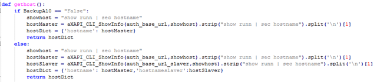
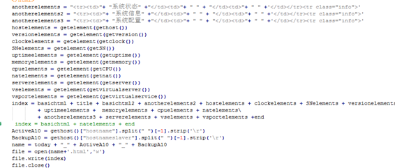
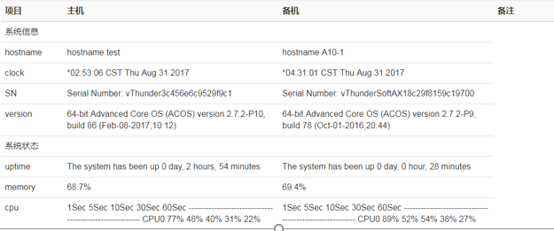

## 初衷

部分客户要求提供自动化巡检工具以便他们自行巡检. 基于此开发了这个脚本.

但这个脚本是否能完全取代人工巡检？ 我认为并不能够。

巡检负载均衡设备需要关注的地方非常多，异常突高流量，异常日志，异常配置条目等等。

这部分的信息很难通过API获取，并进行有效分析。所以这个脚本只能是“初级巡检”，判断下CPU占用、内存占用、配置是否同步这些基础信息。

有条件的话，还是直接登陆到设备进行检查。

## 逻辑分析

脚本主要通过调用python语言调用AXAPI接口, 获取A10设备的相关信息.

如以下函数, 定义了A10 hostname的获取函数.

然后通过数据整合, 输出成一个html文件. 

## 实现效果

## 使用说明

[源代码](http://hk.ivanxie.com/main_272.py)

[配置文件](http://hk.ivanxie.com/A10.config)

将main_272.py与A10.config放置在同目录下,修改A10.config配置,运行main_272.py即可。

## 存在问题

没有设置好异常处理；

不兼容新版本的api；

后续有时间的话再修正。