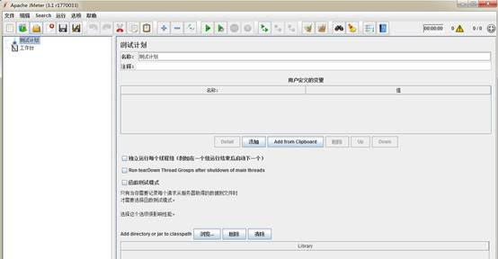
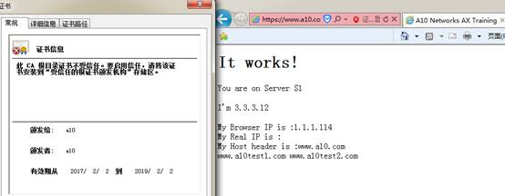
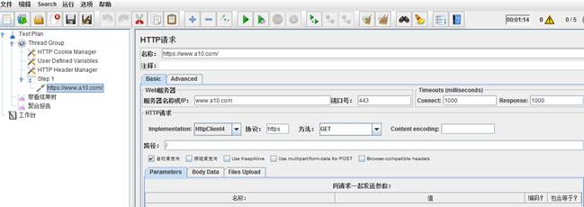
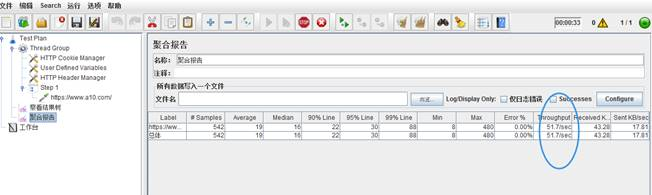
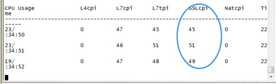
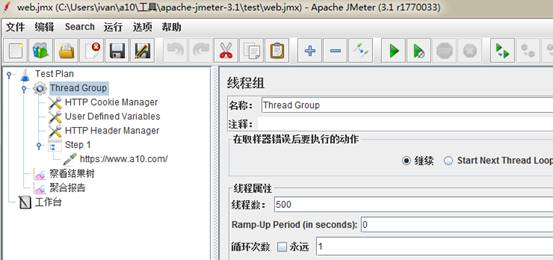
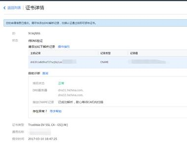
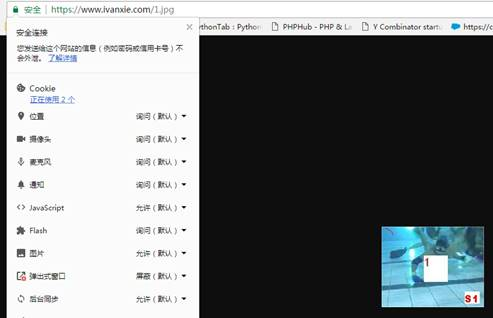

## 概述

目前华南区碰到过几个使用A10做https SSL卸载的项目需求, 部分客户对于SSL性能有明确需求, 但对于A10是否能达到标称值有疑虑, 这里介绍如何使用jmeter进行SSL压力测试.

## 一, 加密cipher及模板配置

目前A10支持的SSL加密算法列表如下(vthunder 4.1.1) :

  SSL3_RSA_DES_192_CBC3_SHA

  SSL3_RSA_RC4_128_MD5

  SSL3_RSA_RC4_128_SHA

  TLS1_RSA_AES_128_SHA

  TLS1_RSA_AES_256_SHA

  TLS1_RSA_AES_128_SHA256

  TLS1_RSA_AES_256_SHA256

  TLS1_DHE_RSA_AES_128_GCM_SHA256

  TLS1_DHE_RSA_AES_128_SHA

  TLS1_DHE_RSA_AES_128_SHA256

  TLS1_DHE_RSA_AES_256_GCM_SHA384

  TLS1_DHE_RSA_AES_256_SHA

  TLS1_DHE_RSA_AES_256_SHA256

  TLS1_ECDHE_ECDSA_AES_128_GCM_SHA256

  TLS1_ECDHE_ECDSA_AES_128_SHA

  TLS1_ECDHE_ECDSA_AES_128_SHA256

  TLS1_ECDHE_ECDSA_AES_256_GCM_SHA384

  TLS1_ECDHE_ECDSA_AES_256_SHA

  TLS1_ECDHE_RSA_AES_128_GCM_SHA256

  TLS1_ECDHE_RSA_AES_128_SHA

  TLS1_ECDHE_RSA_AES_128_SHA256

  TLS1_ECDHE_RSA_AES_256_GCM_SHA384

  TLS1_ECDHE_RSA_AES_256_SHA

  TLS1_RSA_AES_128_GCM_SHA256

  TLS1_RSA_AES_256_GCM_SHA384

  TLS1_ECDHE_RSA_AES_256_SHA384

  TLS1_ECDHE_ECDSA_AES_256_SHA384

 

 

其中, SSL3系列的cipher是因为目前poodle漏洞导致ssl 3 无法保证安全, 建议禁用. 

[参考链接](https://blog.mozilla.org/security/2014/10/14/the-poodle-attack-and-the-end-of-ssl-3-0)

RC4-based的加密算法因为算法偏弱, 有泄密可能, 也建议禁用.

 [参考链接](<https://blogs.technet.microsoft.com/srd/2013/11/12/security-advisory-2868725-recommendation-to-disable-rc4/>)

因此, 建议优先支持RSA和ECDH_RSA密钥交换算法。这也是目前主流站点(taobao, baidu,jd等互联网公司采用的算法)

即在模板里仅调用以下cipher

 

  TLS1_RSA_AES_128_SHA256

  TLS1_RSA_AES_256_SHA256

  TLS1_RSA_AES_128_GCM_SHA256

  TLS1_RSA_AES_256_GCM_SHA384

  TLS1_ECDHE_RSA_AES_128_GCM_SHA256

  TLS1_ECDHE_RSA_AES_128_SHA

  TLS1_ECDHE_RSA_AES_128_SHA256

  TLS1_ECDHE_RSA_AES_256_GCM_SHA384

  TLS1_ECDHE_RSA_AES_256_SHA

  TLS1_ECDHE_RSA_AES_256_SHA384

cipher按以上配置可以满足苹果ATS加密要求.

## 二, A10 https offload配置说明

slb template client-ssl ssl

   cert a10

   chain-cert a10

   key a10

   session-cache-timeout 600

   session-cache-size 1000

  cipher TLS1_RSA_AES_128_SHA256

  cipher TLS1_RSA_AES_256_SHA256

  cipher TLS1_RSA_AES_128_GCM_SHA256

  cipher TLS1_RSA_AES_256_GCM_SHA384

  cipher TLS1_ECDHE_RSA_AES_128_GCM_SHA256

  cipher TLS1_ECDHE_RSA_AES_128_SHA

  cipher TLS1_ECDHE_RSA_AES_128_SHA256

  cipher TLS1_ECDHE_RSA_AES_256_GCM_SHA384

  cipher TLS1_ECDHE_RSA_AES_256_SHA

  cipher TLS1_ECDHE_RSA_AES_256_SHA384

 

 

Session cache 的原理是使用 client hello 中的 session id 查询服务端的 session cache, 如果服务端有对应的缓存，则直接使用已有的 session 信息提前完成握手，称为简化握手. 

Cache会消耗内存资源, A10设备上cache数量如果达到限制数量, 那么最先缓存的cache会被替换. 建议设置从1000起步, 更具体数值可根据测试效果进行调整.

 

目前F5的SSL模板中默认为开启状态, 数值为262,144. 

[参考链接](https://support.f5.com/csp/article/K16303)

 

 

## 三, 压测工具介绍

[Jmeter下载地址](http://mirror.bit.edu.cn/apache/jmeter/binaries/apache-jmeter-3.1.tgz)

 

Jmeter是一个基于java的免费开源性能测试工具, 功能丰富程度与loadrunner接近.

 

下载后解压, 双击 \apache-jmeter-3.1\bin\jmeter.bat 打开图形界面.

 

如果有复杂的https测试, 可以用badboy工具录制一段测试脚本后导出成jmx文件, 再导入jmeter中.

<http://www.badboy.com.au/>

测试页面如下:

本地写host , [www.a10.com](http://www.a10.com) 到1.1.1.21

Jmeter设置页面, 注意这里的连接时间跟响应时间, 设置为1000即超过1000毫秒的链接与响应都视为错误.

 

 

点击上面的三角标志开始测试.

点击聚合报告可以查看到测试进展, 其中Thoughout与在A10上show slb performance的SSL性能一致.

 

 

 

## 四, 常见问题

**使用A10做https 卸载的页面无法打开?**

新版的chrome与firefox对于错误证书默认都无法显示, 用IE试试. 如果需要用chrome ,参考附录的个人证书申请, 申请一个免费证书.

 

 

**如何压测到最大性能?** 

使用多个jmeter客户端进行压测, 根据客户端性能, 适当设置线程(并发会话数).

另外, 确保后端服务器性能足够.

 

**压测时,** **响应延时超过期望值?**

最好能简化测试拓扑, 直接串接进行测试.

另外也检查应用是否有其他异常报错, 在A10可以添加一个脚本记录响应时间超过100ms的页面.

when HTTP_REQUEST {

set request_time [TIME::clock milliseconds]

set host [HTTP::host]

set uri [HTTP::uri]

}

 

when HTTP_RESPONSE {

set response_time [TIME::clock milliseconds]

set latency [expr ($response_time - $request_time)]

  if { $latency >= 100 } {

   log "Slow-Response : User-Access $host$uri, Processing-Server [IP::server_addr]:[TCP::server_port] response latency $latency msec."

  } else {

   log "Fast-Response : User-Access $host$uri, Processing-Server [IP::server_addr]:[TCP::server_port] response latency $latency msec."

  }     

}

## 附录:

###### 个人证书申请

个人使用的话,通过腾讯云申请个人SSL证书非常方便. 只要验证域名所有权通过, 马上可以下载到相应的证书.

[申请说明](https://www.qcloud.com/document/product/400/6814)

 

 

 

###### 参考链接

[百度: 大规模网站SSL实践](http://op.baidu.com/2015/04/https-s01a01/)

[SSLlab 测试](https://www.ssllabs.com/ssltest/analyze.html)

 

​    "